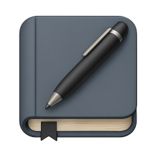
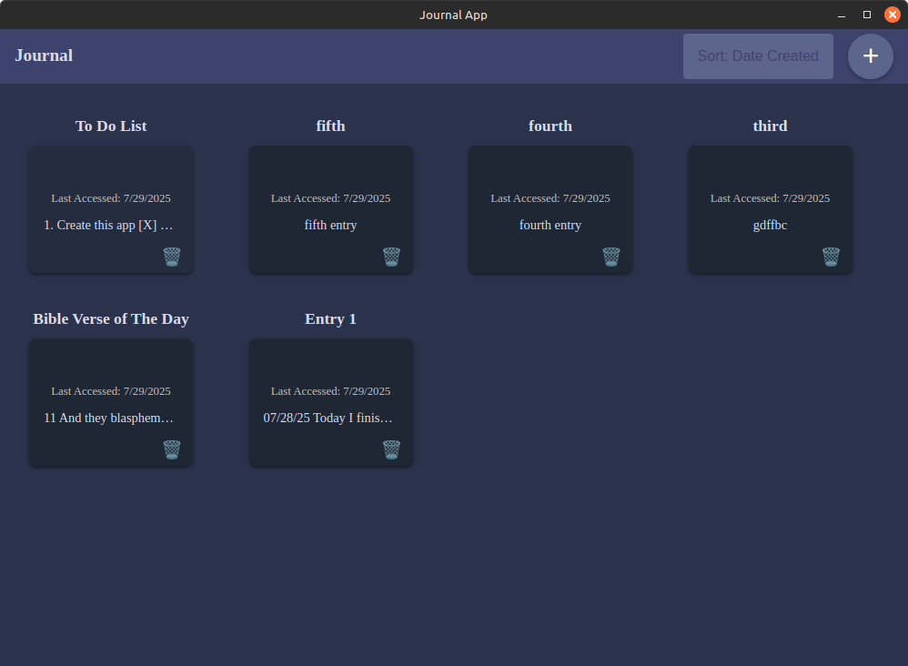
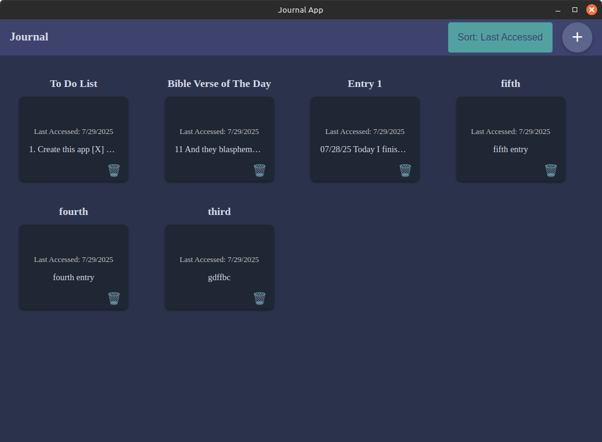
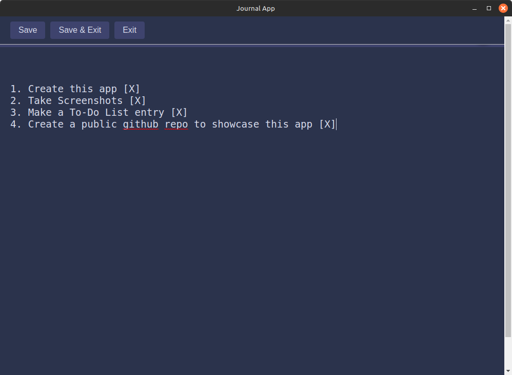

# Journal App

A simple, clean, and modern desktop application for journaling and daily reflections.

## About The Project

The Journal App was created to offer a peaceful and minimal environment for capturing thoughts, prayers, reflections, or anything else on your mind.

This app shares the same foundation as the Bible App and is packaged as a cross-platform desktop application using Electron.

## Features

* **Create Unlimited Entries:** Add as many journal entries as you need. Each entry is fully editable and saved locally.
* **Sort Entries:** View your journal entries sorted by:
  - **Date Created**
  - **Last Accessed**
* **Distraction-Free Writing:** Write whatever you want in each entry using a simple, clean text editor.
* **Local Storage:** All data is stored locally using SQLite—no internet or cloud required.

## Built With

* [Electron.js](https://www.electronjs.org/)
* [Node.js](https://nodejs.org/)
* [SQLite3](https://www.sqlite.org/index.html)

## Download

[Download Latest Release](https://github.com/Bighairymtnman/Journal/releases/latest)

## Screenshots

